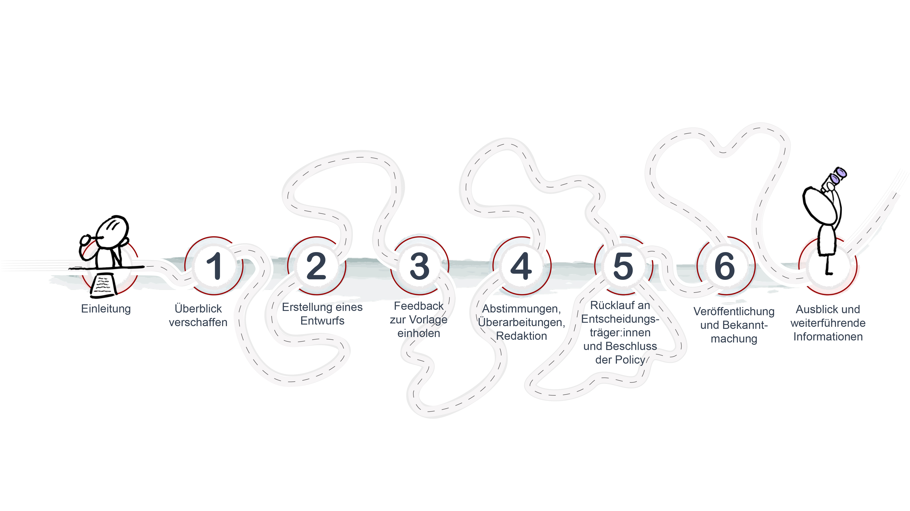

!--
author: twillo
email: support.twillo@tib.eu
language: de
narrator: Deutsch Female
comment: Das OER-Policy Kit steht unter der CC BY SA 4.0 Lizenz
-->
# OER-Policy Kit
Herzlich willkommen!

## Einleitung

Immer mehr Hochschulen in Deutschland bekennen sich zu OER und wollen durch eine Richtlinie ein Signal für Lehrende setzen, dass sie das Erstellen und Teilen von OER gutheißen. Der Weg zu dieser Richtlinie – auch als OER-Policy bezeichnet – kann je nach Hochschule sehr unterschiedlich sein. An einer kleineren Hochschule, wo die Entscheidungswege eher kurz sind, kann der OER-Policy-Prozess entsprechend einfach und schnell sein. An einer größeren Hochschule kann der Weg zu einer OER-Policy hingegen länger dauern, etwa, weil der Beteiligtenkreis größer ist. Neben der bereits angesprochenen Größe der Hochschule bestimmen auch viele weitere Faktoren, wie sich der Entstehungsprozess einer OER-Policy gestaltet, beispielsweise das Stimmungsbild zu OER in Entscheidungskreisen und die Herangehensweise bei der Policy-Entwicklung - top-down oder bottom-up, mehr oder weniger partizipativ usw.

Trotz unterschiedlicher Ausgangslagen gibt es Schritte, die alle Hochschulen auf dem Weg zu einer Policy machen und die Fragen, die sich alle stellen, die einen entsprechenden Prozess anstoßen, nämlich

- Wo und wie anfangen?

- Was soll die Policy enthalten?

- Was ist aus rechtlicher Sicht zu beachten?

- Welche Akteur:innen müssen einbezogen werden? Wen als Erstes fragen?

Um den Hochschulen die Beantwortung dieser Fragen zu erleichtern sowie bei Entscheidungen und generell im Policy-Prozess möglichst gut zu unterstützen, haben wir dieses OER-Policy-Kit erstellt, das als Ratgeber zum Policy-Prozess zu verstehen ist. Unser Policy-Kit basiert auf einer interaktiven Roadmap, die mögliche Stationen beschreibt und Tipps, ggf. inklusive Vorlagen (z.B. Muster-OER -Policy) dazu gibt. Die Roadmap stellt keinen ultimativen Weg zu einer OER-Policy dar, keine Anweisung, die 1:1 befolgt werden muss, sondern versucht trotz der vorhandenen Unterschiede zwischen Hochschulen eine allgemeine Orientierung zu geben.

## Überblick verschaffen

Wenn Sie eine OER-Policy für Ihre Hochschule aktiv anstreben und sich das erste Mal damit auseinandersetzen, einen Policy-Entwicklungsprozess anzustoßen, gehen Ihnen vermutlich folgende Gedanken durch den Kopf:

* Wo stehen wir an unserer Hochschule mit dem Thema OER und wie gehen wir an unserer  Hochschule am besten vor?

* Welche Erkenntnisse gewinnen wir durch den Blick nach Außen? … was steht zum Beispiel in bereits existierenden Policies anderer Hochschulen?

* Welche Anknüpfungspunkte gibt es intern, und wie kommunizieren wir , um den Entwicklungsprozesss erfolgreich zu gestalten? … und welche externen Impulse helfen uns beim Policy-Entwicklungsprozess?

* Wie bei jedem Schritt gilt es zu bedenken: Welche Aufgaben sind in welcher Reihenfolge zu erledigen?

**Wie können Policy-Prozesse erfolgreich ablaufen?**

Unsere Erfahrungen haben gezeigt: Es gibt nicht den einen Weg zur OER-Policy. In der Regel sind die Gegebenheiten, welche die Entwicklung einer OER-Policy beeinflussen, von Hochschule zu Hochschule sehr unterschiedlich und prägen die Vorgehensweise maßgeblich. Die Antworten auf diese Fragen sind so divers wie der Weg jeder einzelnen Policy. Umso relevanter ist es, sich zu Beginn des Prozesses einen Überblick zu verschaffen. Dabei gilt es einerseits, den Blick in die eigene Hochschule zu richten, andererseits aber auch von bereits gemachten Erfahrungen aus dem Außen zu profitieren.

### Wie ist der Status quo an der eigenen Hochschule?
Hier geht es darum, sich die Voraussetzungen für den OER-Policy-Prozess an der eigenen Hochschule genauer zu betrachten. Fragen, die sich stellen sind:

- Wo steht das Thema OER in der gelebten Kultur der Hochschule?
- Sind OER bereits im Hochschulalltag verankert oder kaum bekannt?
- Ist die Haltung gegenüber OER positiv, oder dominieren Ängste oder Vorbehalte?
- Welche Rolle könnte/soll die OER-Policy an der Hochschule aufgrund dieser Vorbedingungen spielen?
- Welche Auswirkungen ergeben sich daraus für die weitere Vorgehensweise?

Besonders lohnt es sich, bereits vorhandene Policies, Leitbilder, Strategiepapiere und ähnliche Dokumente der Hochschule und deren Entstehungsgeschichte zu durchleuchten und an diese anzuknüpfen. Des Weiteren sollten Sie in der Anfangsphase Kolleg:innen an der Hochschule identifizieren (sofern Ihnen diese noch nicht bekannt sind), die intrinsisch motiviert oder qua Funktion Berührungspunkte mit dem Thema OER(-Policy) haben (oder haben sollten), und als Mitstreiter:innen zu gewinnen. Darüber hinaus ist zu berücksichtigen, ob ein offizieller Auftrag der Entscheidungsebene erforderlich ist, bevor die Arbeit an einer OER-Policy beginnen kann.

Ein wichtiger Aspekt ist dabei, wie hochschulstrategische Innovationsprozesse an Ihrer Hochschule in Gang gebracht werden, um den Policy-Prozess der Arbeitskultur Ihrer Einrichtung anzupassen. Als Ausgangspunkt für die weiteren Überlegungen öffnen wir hier ein Spektrum zwischen den beiden Polen “Top-down” und ”Bottom-up” als Ausgangspunkte für die Gestaltung des Policy-Prozesses.

Bei allen genannten Punkten sollten Sie, gerade wenn Sie noch nicht lange an Ihrer Hochschule tätig sind, mit erfahrenen Kolleg:innen Rücksprache halten und diese ggf. um Beratung bitten. Alle Aspekte werden nun im weiteren Verlauf detaillierter dargestellt.

  
**Strategiepapiere als Anknüpfungspunkte**

  Hier lohnt ein Blick ins Eingemachte der Hochschule. Sei es in zentralen Dokumenten wie dem Hochschulentwicklungsplan oder Zielsetzungsdokumenten einzelner Fakultäten, Instituten  oder Fachbereichen. Aber auch Leitbilder, verschriftliche Visions- und Positionspapiere können Hinweise darauf geben, inwiefern eine OER-Policy als Ausdruck einer Kultur gelebter Offenheit auf fruchtbaren Boden fällt. Gegebenenfalls gibt es bereits Poliies, die Openess im Namen tragen und Hinweise auf Stakeholder und Ansprechpartner:innen geben. Tipps hierzu finden sich im Abschnitt “Anknüpfen”.

**Mitstreiter:innen identifizieren**

Die Identifikation von OER-Befürworter:innen unter den Lehrenden und Lernenden sowie den akademischen Führungsebenen sowie in den diversen zentralen Hochschuleinrichtungen ist der wohl wichtigste Schritt in der Phase des Überblick verschaffens. Möglicherweise gibt es bereits AGs oder Strategiegruppen, die Facetten von Openess bearbeiten. Im Abschnitt “Vernetzen und Anknüpfen” gehen wir detailliert auf unabdingbare und potenzielle Stakeholder ein und berücksichtigen auch, dass es wichtig ist, von  anderen als Mitstreiter:in erkannt und gefunden zu werden

**offizieller Auftrag als Startpunkt?**

Beim Start einer OER-Policy an Hochschulen ist oft ein offizieller Auftrag nötig, den Entscheidungsträger:innen erteilen müssen. Grundsätzlich ist es wichtig, diese früh einzubinden, um die Machbarkeit und Unterstützung für den Prozess zu prüfen.  Es geht ja um ein Dokument, das die gesamte Hochschule betrifft, und letztlich auch um die Legitimation, Ressourcen der Hochschule zu binden, da ja die Entwicklung einer OER-Policy die Arbeitszeit aller Beteiligten beansprucht. Die vorhandene Expertise zu OER bei den Entscheidungsträger:innen bedingt dabei häufig die Freiheitsgrade des Auftrags zum Entwurf einer OER-Policy und kann den am Policy-Prozess Beteiligten recht viel Gestaltungsspielraum bieten.

Sollten Sie anfangs auf Widerstand stoßen, lassen Sie sich nicht demotivieren, sondern beweisen Sie Fingerspitzengefühl und Geduld, indem Sie das Thema OER-Policy mit etwas zeitlichem Abstand wieder auf die Agenda setzen. Es kann sein, dass Sie erst bei einem späteren Anlauf Rückhalt für Ihre Idee finden, beispielsweise wenn sich die personelle Situation geändert hat oder andere, zu diesem Zeitpunkt priorisierte Themen abgearbeitet wurden.

**Top-down oder Bottom-up?**

Ob der Policy-Prozess an Ihrer Hochschule ein Top-down oder Bottom-Up angesetzt ist, hängt in erster Linie von der Arbeitskultur an Ihrer Hochschule ab.
Ungeachtet dessen, wo sie starten, bergen OER-Policies immer Spannungspotenzial. Das liegt u.a. daran, dass Policies letztendlich aufgrund ihres normativen Charakters Top-down-Ansätzen zugeordnet werden. Auf der anderen Seite sind OER-Communities typischerweise eher Bottom-up organisierte Phänomene mit einer spezifischen Kultur und dementsprechend spezifischen Werten. Solche Communities durch Anweisungen zu regeln kann daher einen "clash of cultures" provozieren.

Um das Potenzial einer OER-Policy – Veränderungsprozesse in Richtung Openness und einer Kultur des Teilens steuernd zu unterstützen – auszuschöpfen, bedarf es bei der Entwicklung und Implementierung ein gewisses Maß an Feingefühl, Reflexionsbereitschaft und Offenheit (Deimann, Neumann et al., 2015, S.41). Wünschenswert wäre das natürlich auch bei Ihren Adressat:innen.

Die Herausforderung bei der Gestaltung einer OER-Policy liegt unabhängig davon, ob der Anstoß von Entscheidungsträger:innen kommt oder ob zunächst Überzeugungsarbeit innerhalb der Hochschule geleistet werden muss, darin, sowohl konkrete Inhalte zu definieren als auch eine breite Akzeptanz zu schaffen. Ob Sie nun einen offiziellen Auftrag haben oder selbst die Initiative ergreifen, das Engagement für OER-Policies ist immer auch ein Plädoyer für die Philosophie von OER selbst.

### Der Blick ins Außen (über den Tellerrand)

Neben der institutionellen Brille, die sich aus dem  Status Quo ergibt, sollten auch Perspektiven aus dem Außen mit in die Bestandsaufnahme einfließen. Konkret können dies bereits abgeschlossene Policy-Prozesse anderer Hochschulen sein, die in bereits veröffentlichten Policies gemündet sind.  Welche Hochschulen dies sind, lässt sich durch Internetrecherche leicht feststellen, es lohnt sich auch ein Blick auf die Karten von twillo und ORCA.nrw, die bereits veröffentlichte Policies in Niedersachsen und Nordrhein-Westfalen zeigen (siehe Schritt 2: Entwurf). Eine fertige OER-Policy offenbart jedoch natürlich nicht den zugrunde liegenden Entstehungsprozess. Daher ist es ratsam, die Beteiligten zu identifizieren und sich mit ihnen zu vernetzen. Im Austausch mit diesen externen Kontakten können Sie konkrete Fragen zum Policy-Prozess stellen, Gelingensbedingungen ermitteln und Vergleiche zu den Gegebenheiten an Ihrer Hochschule herstellen. Die potenziellen Abteilungen/Ansprechpartner:innen sind dabei in der Regel analog zu den internen Strukturen. Entsprechend verweisen wir auch hier auf den folgwnswn  Abschnitt “Vernetzen und Anknüpfen” für detaillierte Informationen.

Wir empfehlen Ihnen diese Herangehensweise, um von den Erfahrungen anderer Hochschulen zu profitieren und die Weichen dafür zu stellen, dass Ihr Weg zur OER-Policy ebenfalls erfolgreich verläuft.

**Anknüpfen**

Vielleicht gibt es an Ihrer Hochschule schon Prozesse oder sogar bereits Policies, Strategiepapiere oder Leitbilder, an die man mit dem Thema OER gut anknüpfen kann. Beispielsweise können dies sein:

- Digitalisierungsstrategie der HS
  - falls an Ihrer HS schon eine Digitalisierungsstrategie vorliegt, sollten Sie in Erfahrung bringen, inwieweit in dieser OER oder Openness bereits thematisiert werden
  - möglicherweise wird so ein Papier auch gerade noch von einer Digitalisierungs-AG oder einem Gremium entwickelt (in diesem Fall ist eine Kooperation anzustreben)
- Bestehende Openness-Policies oder Prozesse
  - evtl. gibt es an ihrer HS bereits eine Open Science oder Open Access Policy oder andere Openness-Richtlinien (idealerweise fragt man bei der Bibliothek nach, da das Thema Veröffentlichen meist dort verortet ist)
  - vielleicht gibt es keine explizite Policy, aber eine AG oder Interessengemeinschaft zum Thema Open Access oder Open Science, auch hier kann die Bibliothek eine gute Anlaufstelle sein
- Das Thema OER ist eng mit Nachhaltigkeit verknüpft. Und auch wenn in einem Nachhaltigkeitsleitbild Ihrer HS das Thema OER nicht explizit erwähnt wird, so kann es dennoch als Argument für das Thema Nachhaltigkeit in der Lehre und somit OER dienen, einige Bsp.:
  - Uni Bielefeld (OER explizit erwähnt)
  -  Uni Bamberg (basiert auf den SDGs der UNESCO)
  - RWTH Aachen (Verweis auf BNE und  “Offenheit der Lehre”)
  - Uni Hamburg (Bezug zu SDGs)
  - Uni Siegen
  - TU Chemnitz
  - Uni Kassel
  - FU Berlin
  - Uni Bonn

**Vernetzen**

OER sind als Querschnittsthema in vielen Organisationseinheiten sowie für verschiedene Akteur:innen der Hochschule unterschiedlich relevant. Entweder spielen sie schon explizit oder implizit eine Rolle im Arbeitsalltag oder könnten zukünftig von Bedeutung sein, wenn ein Bewusstsein für die Thematik geschaffen wurde.

Den Status quo und die (explizite oder implizite) Bedeutung des Querschnittsthemas OER in der eigenen Hochschule, aber auch die passenden Ansprechpartner*innen zu identifizieren und diese ggf. davon zu überzeugen, das Vorhaben OER-Policy zu unterstützen, kann eine komplexe Aufgabe werden, insbesondere wenn man sich erst noch an der eigenen Einrichtung vernetzen muss. Aber es lohnt sich! Auch das Anknüpfen an Bestehendes macht die Relevanz des Themas deutlich und hilft dabei, Gleichgesinnte zu finden.

### Kommunikation “nach innen"
**“Verbündete” finden**
Die Identifikation von OER-Befürworter:innen, aber auch sonstigen Stakeholdern und damit (potentiell) wichtigen Mitstreiter:innen an der eigenen HS ist eines der wichtigsten Arbeitspakete und kann zugleich schwierig sein, wenn man, zumindest oder nicht nur in Bezug auf das Thema OER, noch nicht so gut an der HS vernetzt ist.

Es bietet sich einerseits an pragmatisch einzusteigen und zunächst das Gespräch mit Vorgesetzten bzw. Kolleg:innen der eigenen Abteilung zu suchen, um herauszufinden, welche Personen bzw. Organisationseinheiten bekannt dafür sind, sich im Arbeitsalltag mit OER zu beschäftigen und diesen gegenüber grundsätzlich positiv eingestellt sind. Auf der anderen Seite geht es auch darum, Stakeholder zu ermitteln, die sich bisher noch nicht oder nicht explizit mit den Themen OER und OER-Policy befasst haben, aber in den weiteren Prozess einbezogen werden sollten, weil sie über Expertise und Erfahrungen verfügen, die für Berührungspunkte sorgen und ihre Mitwirkung nahelegen. Außerdem sollten SIe in Erfahrung bringen, wie ähnliche Prozesse bisher an Ihrer HS abgelaufen sind und welche Stakeholder involviert waren bzw. zwingend immer involviert sein müssen, wenn so ein Vorhaben von hochschulweiter Bedeutung umgesetzt werden soll.

Einen eher theoretischen Einstieg in die Überlegungen darüber, wen man ansprechen kann oder muss, bietet das “Whitepaper Open Educational Resources (OER) an Hochschulen in Deutschland” (Deimann.2015b). Bei der Lektüre ist man auch gleich mal über ein paar relevante Namen aus der deutschsprachigen OER-Szene gestolpert, was bei der Auseinandersetzung mit einer derart komplexen Thematik nie schaden kann (#Verbündete). Die Autoren des Papers verweisen insbesondere auf folgende Einrichtungen/Personen als relevante Stakeholdergruppen:

**Hochschulleitung**

Wie bereits erwähnt, erleichtert es Ihre Anstrengungen, wenn Sie die Hochschulleitung möglichst früh ins Boot holen. Hierbei hängt es von den Gegebenheiten der jeweiligen HS ab, ob man die jeweiligen Personen (z.B. Vizepräsident:in oder Prorektor:in für das Thema Studium und Lehre) direkt ansprechen kann. Am besten klärt man im Team oder mit Vorgesetzten, welche Wege man einhalten muss, um mit der Leitungsebene zu kommunizieren und wen man da am besten adressiert. Je nachdem, wie vertraut diese Entscheidungsträger:innen mit den Potenzialen von OER und den Zielen einer OER-Policy sind, bietet es sich an, bei einem initialen Gespräch diese Punkte noch einmal hervorzuheben und ggf. mit Hilfe von Materialien (wie einer Powerpoint-Präsentation) und Beispielen zu erläutern. Je nach Ihrer Vorgehensweise (Bottom-Up oder Top-Down) ist es sinnvoll, in dieser Runde auch den Weg, den Sie gehen wollen - Ihre OER-Policy-Roadmap - aufzuzeigen.
Verweise:
Abbildung Roadmap
Ziele und Potenziale von OER
Verlinkung zur Thematik: OER (impact) Forschung
Vielleicht bietet sich auch gleich eine "Muster PPT" an?

**Zentrale Hochschuleinrichtungen und Stabsstellen**

***Hochschulbibliotheken***
Bibliothekar:innen spielen aufgrund ihres ausgeprägten Problembewusstseins hinsichtlich neuer Arten des wissenschaftlichen Publizierens eine (besondere) Multiplikator:innenrolle (Deimann et al., 2015, S.48). Ein wichtiges Thema kann hierbei die DOI-Vergabe für OER darstellen. Ein Digital Object Identifier (DOI) bietet u.a. das Potenzial, Lehr-Lernmaterialien besser zu identifizieren und somit leichter auffindbar zu machen und sie über geeignete Schnittstellen in Recherchesystemen der Bibliothek einzubinden. Auch die Möglichkeit, neben den klassischen Publikationslisten eine Liste mit veröffentlichten Lehr-Lernmaterialien z.B. auf Personenseiten von Hochschullehrenden anzeigen zu lassen, zahlt auf das Konto "Sichtbarkeit von Lehre" ein. Oftmals finden in Hochschulbibliotheken schon Aktivitäten zur Förderung von OER-Nutzung und Veröffentlichung statt oder werden angestrebt. Es ist daher anzunehmen, dass Sie hier Mitstreiter:innen finden werden, die Ihre Bestrebungen zur Entwicklung einer OER-Policy mittragen oder aktiv unterstützen wollen.

E-Learning- und IT-Abteilungen
Ein gemeinsames Thema mit den "E-Learning"-Abteilungen (und vielleicht auch mit den Bibliotheken) der Hochschulen hängt eng zusammen mit der DOI Vergabe für OER (siehe Biblitoheken bzw. Bibliothekar:innen). So gibt es z.B. Hochschulen, die einerseits ihr Learning Management System (LMS) (Beispiele) oder ihr Medienportal (Beispiele) so geöffnet haben, dass neben den Mitgliedern der Hochschule auch Personen von außerhalb darauf zugreifen können. Hierbei gibt es die Möglichkeit, über geeignete Schnittstellen Kurse im offenen LMS im OERSI zu indexieren (Verweis auf das "Open RUB" der RUB). Für die Hochschule und insbesondere das Justiziariat kann es sinnvoll sein, eine Art OER-Check als obligatorischen Zwischenschritt zwischen Kurserstellung und Kursveröffentlichung zu schalten. Die Vergabe eines OER-Zertifikats und die damit verbundene Freischaltung der Zertifikatsinhaber:innen für die Veröffentlichung im offenen LMS stellt eine ebenfalls eine Möglichkeit dar zu gewährleisten, dass hierbei rechtliche Grundlagen eingehalten werden. Hierbei ist ein sinnvoller erster Schritt sicherlich die Einrichtung eines 'runden Tisches' mit zentralen IT-Abteilungen, E-Learning-Abteilungen und den Abteilungen für Medien- und Hochschuldidaktik” (Deimann et al., 2015, S.48).

E-Learning und Hochschuldidaktik
Weitere Unterstützer:innen für eine OER-Policy sind vermehrt in Einrichtungen, in denen hochschul- und mediendidaktische Fragen eine zentrale Rolle spielen, also z.B. Servicestellen für Lehre und Studium, E-Learning-Abteilungen, hochschuldidaktische Zentren usw., anzutreffen. Diese haben das Thema OER häufig schon in ihr Informations-, Beratungs- und Veranstaltungsangebot integriert. An einigen HS spielen OER in Verbindung mit dem genutzten LMS eine Rolle, wenn dieses etwa direkt an eine OER-Plattform angebunden ist (z.B. Verknüpfung zwischen OER Campus in Stud.IP und twillo) oder wenn sich Kurse im offenen LMS im OERSI indexieren lassen (z.B. “Open RUB” der RUB). Mancherorts werden von hochschul- und mediendidaktischen Abteilungen bereits OER-Zertifikate vergeben, die ihren Inhaber:innen beispielsweise besondere Veröffentlichungsoptionen für OER ermöglichen.

Justiziariat
Das Justiziariat ist als zentrale Rechtsabteilung der HS in jedem Fall im OER-Policy-Prozess unumgänglich und sollte so früh wie möglich einbezogen werden, um zu gegebener Zeit Eckpfeiler für die Inhalte der Policy abzuklären und den späteren Textentwurf rechtlich “wasserdicht” zu machen.

Lehrende
Die Gruppe der Lehrenden ist sicherlich die bedeutendste Gruppe der OER-Stakeholder:innen, denn sie sind es, die die mit dem Thema OER eng verbundene Kultur des Teilens an der Hochschule leben. Zur Identifikation von Lehrenden, die sich bereits zu der Thematik austauschen können, lohnt es sich, Kontakt zu Projekten aufzunehmen, die OER erstellen oder erstellt haben. Hierbei kann es sein, dass es Projekte aus expliziten OER-Förderlinien gibt (wie z.B. die Förderlinie OERcontent.nrw) oder aber Projekte, bei denen die Veröffentlichung als OER Förderbedingung ist oder mitgedacht wird (z.B. “Qualität plus” in Niedersachsen).
Es gibt allerdings auch viele Lehrende, die bereits intrinsisch motiviert OER erstellen. Ein Charakteristikum der OER-Community an Hochschulen ist, dass diese Akteur:innen oft über die Hochschule verteilt und unabhängig voneinander agieren. Diese Lehrenden quasi "auf eigene Faust zu finden" kann eine große Herausforderung darstellen. Helfen können dabei oftmals die hochschuldidaktischen und E-Learning-Einrichtungen, denen diese Lehrenden aus Beratungen und Veranstaltungen bekannt sind. Eine interessante Personengruppe stellen hierbei auch die Dekane (bzw. Fachbereichsleitungen) dar. Sie haben u.U. einen umfassenderen Blick auf die Lehrenden der jeweiligen Fakultät bzw. des jeweiligen Fachbereichs, sie stehen bereits im Austausch mit der Hochschulleitung und denken strategische Prozesse an der Hochschule mit.

Studierende
Das Thema OER mit Studierenden stellt einen großen Themenkomplex dar, der an dieser Stelle nicht umfassend behandelt werden kann. Einerseits gibt es hier andere Ziele, die mit OER verfolgt werden können. Zudem stellt dieser Themenkomplex besondere juristische Anforderungen, da das Urheberrecht von Studierenden besonders stark geschützt ist und es daher besonderer Vorbereitungen bedarf, wenn Studierende dazu angeregt werden sollen, auf die damit verbundenen Rechte zu verzichten. Die Veröffentlichung von Lehr-Lernmaterialien, die von und mit Studierenden erstellt wurden, bietet jedoch besonderes didaktisches Potenzial, welches im Bereich des Peer Learning bzw. Peer Teaching zu verorten ist. Für bestimmte Lehrende bietet OER die Chance eines Wandels in der Lehr-Lernkultur. Diese Lehrenden zu identifizieren kann dabei helfen, Kontakt zu OER-affinen Studierenden herzustellen.
Andere Interessengruppen

Verweis auf Netzwerke oder AGs mit Bezug zu Openness wie z.B.
Open Access und ähnliche Publikationsformen
Open Science bzw. Open Data und diesbezügliche Forschungskompetenzen
AGs oder Strategiegruppen

Weitere relevante Stakeholder:
Neben dem Suchen nach und Finden von OER-Befürworter:innen ist zudem das (frühzeitige) Einbeziehen weiterer Stakeholder an der Hochschule relevant, die im Laufe des Policy-Entwicklungsprozesses mitwirken bzw. eine wichtige Rolle spielen. Hier lohnt es sich ggf. schon ab dem ersten Entwurf, diese Schnittstellen zu informieren und miteinzubeziehen:
AGs oder Strategiegruppen, die sich mit Digitalisierung, Lehre/Hochschuldidaktik, Open Access/-Science/-Data, Hochschulentwicklung und verwandten Themen auseinandersetzen
Datenschutzbeauftragte
Gremien (Senat, Hochschulrat etc.)
Gleichstellungsbeauftragte
Schwerbehindertenvertretung
Personalräte

Sich von (zukünftigen) “Verbündeten” finden lassen
Zusätzlich zum “Klinkenputzen” kann man aber auch versuchen, die relevanten Akteur:innen zu sich kommen zu lassen. Die Durchführung von OER-Workshops oder Informationsveranstaltungen oder damit in Verbindung stehenden Formaten (wie z.B. einen OER-Zirkel eine Open Science Week oder eine Woche der Forschungskompetenzen) bietet die Möglichkeit, Personen zu identifizieren, die an OER oder an Openness in der Hochschule im allgemeinen interessiert sind.

Eine OER-Homepage bzw. ein gesonderter Bereich zu diesem Thema innerhalb des Webauftritts einer Abteilung der HS, die sich mit OER beschäftigt, mit einer Ansprechperson inkl. E-Mail-Adresse, kann hierbei hilfreich sein. Hier kann man auch auf weitere Infos/Dokumente verweisen, wie z.B. eine Checkliste OER oder ein OER Glossar. Es gibt mittlerweile eine Vielzahl an OER-Selbstlernmaterialien bzw. -kursen (Link zur Liste), durch die man sich eigenständig grundlegende Kenntnisse zum Thema OER aneignen kann. Einige Hochschulen arbeiten auch mit festen OER-Sprechstunden, während andere auf Anfrage beraten.

Vernetzung nach aussen
mit Externen OER Aktivisten sprechen
rund um die OER Portale (Link zur Karte)
OERinfo
Tagungen/Veranstaltungen (so wie das OER Barcamp von Jöran)
OER Policy Karten NS und NRW
KNOER AG OER Policy
twillo-Policy-Netzwerktreffen

## Erstellung eines Entwurfs
## Feedback zur Vorlage einholen
## Abstimmungen, Überarbeitungen, Redaktion
## Rücklauf an Entscheidungsträger und Beschluss der Policy
## Veröffentlichung und Bekanntmachung: Türöffner für weitere OER-Aktivitäten
## Ausblick und weiterführende Informationen
